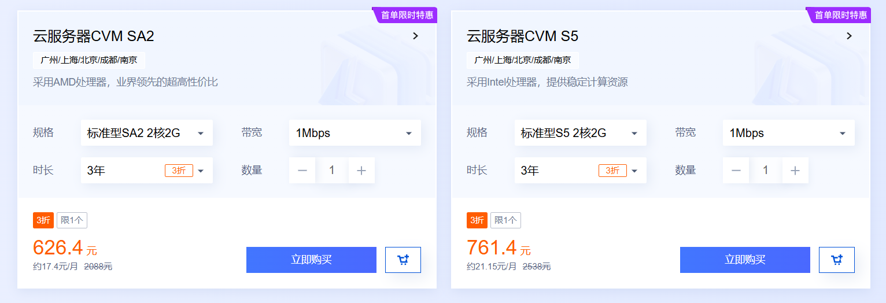
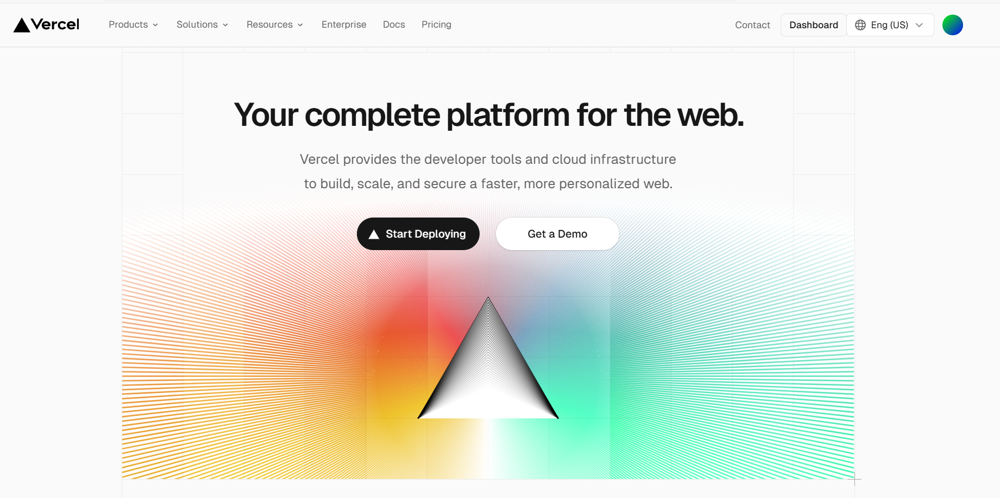
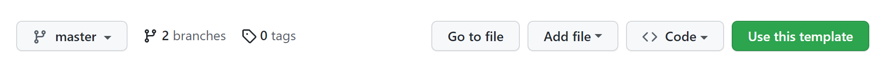
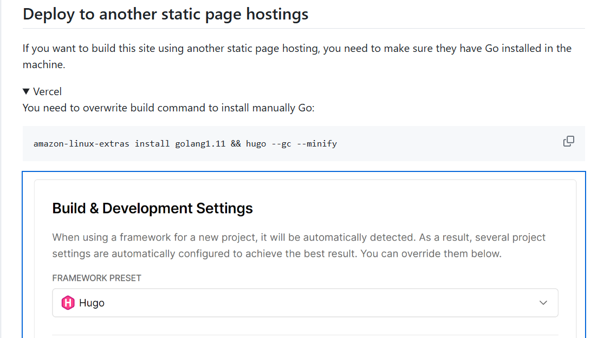
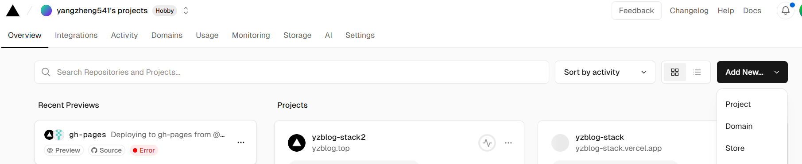
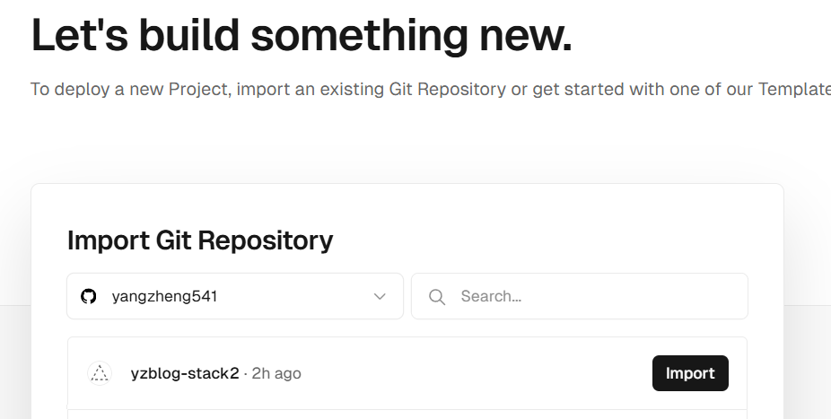
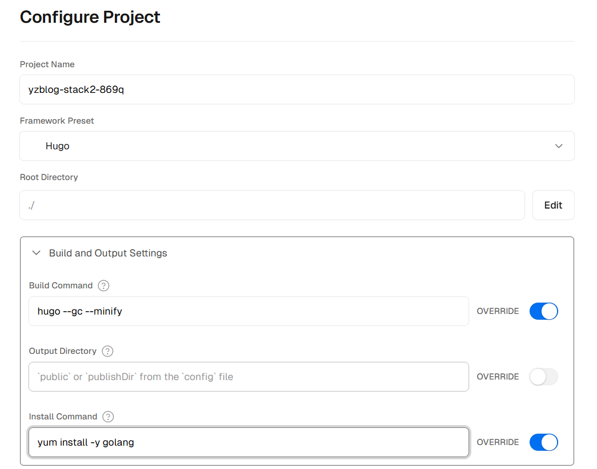
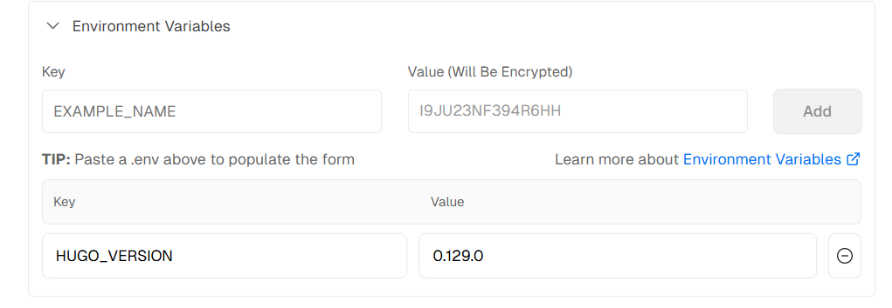
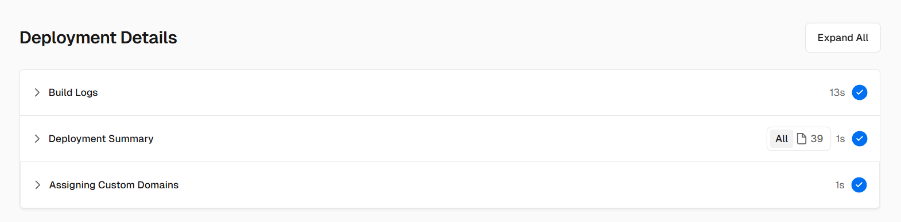

## 前言

程序员的尽头众说纷纭，有人说是`秃头`（叉掉），还有人说是咸鱼——但经研究发现，程序员还是爱写博客。虽然最近变成了非在编程序员，但暑假闲着无事，还是重拾起来了兴趣，决心做个博客起来。

然而逛了几圈阿里云，发现学生优惠已经处于不可用状态，3年的云服务器正常价格为600+。



本着能薅羊毛绝不妥协的精神，加之未发工资的囊中羞涩，最后选择了零成本建站。那么回想起听说过的零成本建站，无非就是GithubPage、GitteePage这两个平台。而Github选手，因为访问速度问题首先退赛。之后就是Gitee，但上了网站看了一圈后发现，Gitee居然已经停止服务了！（气抖冷）

再次寻找后，发现Vercel也是一个不错的平台。该平台可从Github中快速导入项目，并在其中直接部署，同时对Github的提交即时更新。此外，Vercel还免费提供了每个月100GB的访问带宽，对个人网站绰绰有余，还能支持各种模板，从Hugo、Huxo到Wordpress应有尽有。如此香的网站，没有不用的道理，搞它！



## Hugo-Stack博客框架

### 认识Hugo

首先，我们需要找到一款好用的博客项目。最好用的框架当然是Wordpress，但Wordpress过于臃肿，大多数功能对于我这一个小网站而言不常用到。轻量级的博客框架中，Hugo、Huxo、Typecho都是不错的选择，最终我选择了Hugo——该框架由Go语言开发，在渲染能力上略有优势。

> Hugo 是最受欢迎的开源静态站点生成器之一。凭借其惊人的速度和灵活性，Hugo 让构建网站再次变得有趣。——[The world’s fastest framework for building websites | Hugo (gohugo.io)](https://gohugo.io/)

Hugo虽然没有Wordpress那么长的开发时间，但是也已经产生了许多美观的主题。Stack就是其中之一，该主题是卡片风格的博客主题，在Github上有4.6k的star，说它是最受欢迎的Hugo主题也不为过。于是，我们选用该主题制作博客。


### 从Github上克隆Stack主题

首先，你需要有一个Github账号。这是由于Vercel是需要关联到Github仓库的，我们需要将Stack主题克隆到自己仓库中。点击下方链接，访问到Stack的启动器仓库。并点击使用该模板。



[1]: https://github.com/CaiJimmy/hugo-theme-stack-starter	"Stack主题启动器"

点击成功后，该模板将成功到克隆到自己仓库之中。下一步，我们将在Vercel中对该模板进行导入。同样地，你也应该注册一个免费的Vercel账号。

PS：注意！在注册时，你应该直接使用<mark>Github账号授权注册</mark>，这样在后面的导入项目中将更加方便！

## Vercel导入及配置

### Stack主题的Github文档纠错

在上文的1号链接中，你可能发现在Stack启动器文档的最下方，有一个vercel的小字。点击展开，里面就描述了如何运用Vercel导入的方式。



然而，该方式存在错误！请勿按照该配置导入！！这个下载Go的指令已经失效了，并且需要的Hugo版本也不对（血泪的教训）。正确的导入配置如下所示。

### 导入Stack主题

#### 创建项目

来到Vercel的控制台页面，点击右上角的ADD按钮，添加一个新的Project项目。



#### 直接导入Github项目

如果你在注册账号时使用的就是Github授权，那么在这里，你可以很方便的看到你已经公开的仓库。直接点击Import，导入即可。



#### 构建项目

##### 参数设置

- 第一个空填写项目名称，这里随便填写即可；

- 第二个空框架选择Hugo；

- 第三个空是根目录设置，这个我们不必管它；

- 第四个空是构建命令，这里我们需要打开覆写按钮并输入下面的代码，该代码用于Hugo的编译运行。

```
  hugo --gc --minify 
```

- 第五个空是下载命令，用于下载编译所需的go环境。需要注意的是一定要加上-y这个参数，因为yum下载golang时需要确认，-y为无需确认的参数配置，如果不加则会卡死在等待确认的过程中。下载命令如下：

```
  yum install -y golang
```



##### 环境变量设置

环境变量用于设置Hugo的版本，在这里我们设置<mark>Hugo版本为0.129.0（最新版本）</mark>，填好后点击ADD添加。Stack的文档中给的是0.93.2的版本，导致我运行失败，多次检查后才发现该问题....QAQ



#### 部署项目

完成上述配置后，点击Deploy即可直接部署。不出意外的话，等待20s左右，项目即可部署成功。




## 域名配置

当部署完成后，你会进入到一个完结撒花的页面，中间有我们刚刚成功部署的网站。然而，你发现点击进去后，无论等待多久，似乎都无法加载出来——这是因为Vercel的域名遭到了`DNS污染`，无法直接访问。

所以，如果你想要你的网站能够正常访问的话。还是需要付出一点小小的代价——购买域名（腾讯云上，<u>最便宜的一年只要5元</u>，四舍五入也约等于零成本了）。购买域名的网站有很多，包括国内的腾讯云、阿里云，国外的namesilo之类的都可以，在这里我选择的是namesilo购买。

[2]: https://www.namesilo.com/	"namesilo域名购买网站"

在经过一系列的配置（也蛮复杂的）之后，你的网址即可正常访问啦！关于域名的配置，计划再开一章单独记录，详情请见后文叙述。
